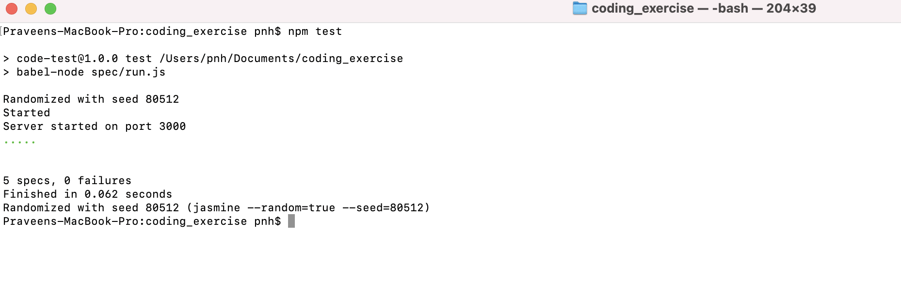
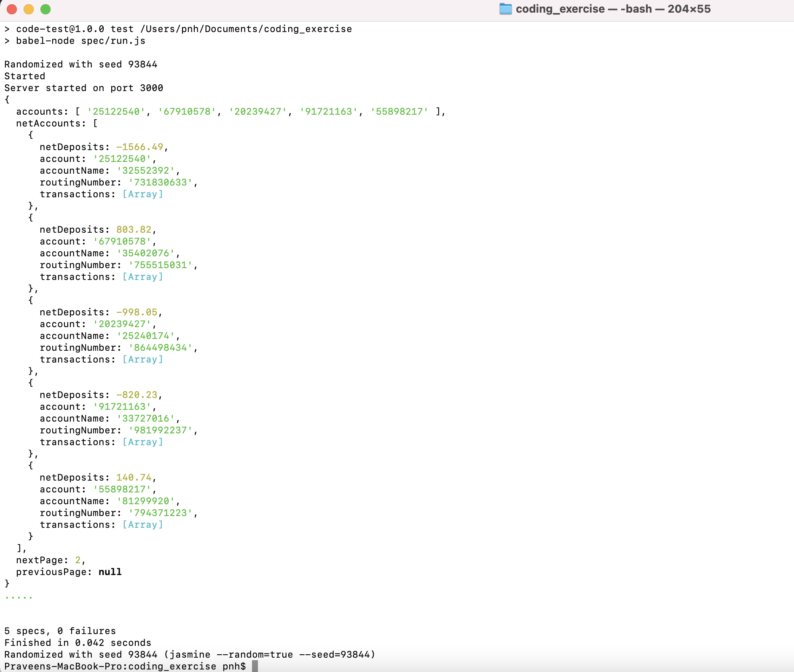
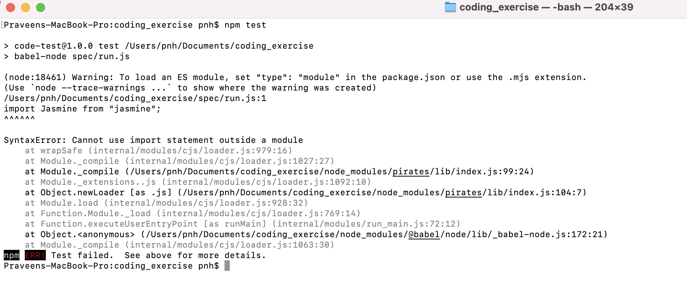
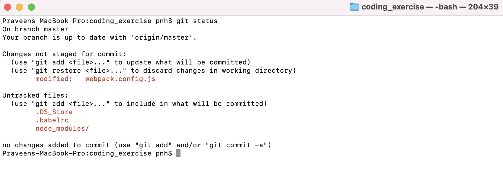

# Code Test

## Setup

**Requires**: NodeJS >= 13, npm. Available [here](https://nodejs.org/en/).

Install the project with `npm install`.

`npm test` to run the provided tests.

## Account API

You are provided with an API endpoint `/account` that will return a JSON array of items in the following format:

```JSON
[
    {
        account: "25122540",
        accountName: "32552392",
        routingNumber: "731830633",
        transactions: [
            {
                transactionType: "deposit",
                amount: 700.16
            }
        ]
    }
]
```

The endpoint accepts the following options:

1. **count**: The number of items to return.
2. **offset**: The index of the first item to return.

## Tasks

1. Write a function called `retrieve` in `api/accounts.js` that consumes the `/accounts` API to return pages of 5 items.
2. The `retrieve` function should accept an options object containing the following key:

   - **page**: Indicates which page should be retrieved. Should default to the first page if not supplied.

3. If an error is encountered log the error with `console.log` and recover.
4. On a successful request, transform the payload into an object with the following keys:

   - **accounts**: An array containing the account numbers of all items in the request.
   - **netAccounts**: An array containing all objects returned from the request with an additional key called `netDeposits` that contains the sum of all deposits minus the sum of all withdrawals for that specific account.
   - **nextPage**: The page number of the next page of results or `null` if this is the last page.
   - **previousPage**: The page number of the previous page of results or `null` if this is the first page.

5. Return a promise from your `retrieve` function that resolves with the transformed data.

## Requirements

1. Only modify the `api/accounts.js` file.
2. Please do not add any additional libraries to your solution.
3. Ensure your code passes all tests.
4. Please write your solution using the Fetch API. For documentation see [here](https://developer.mozilla.org/en-US/docs/Web/API/Fetch_API/Using_Fetch).
5. Avoid using any `for` or `while` loops.
6. Feel free to use external resources for help but please do not copy any solutions from online--we would like to see your solution and thought process.
7. Please delete the `node_modules` folder before zipping and submitting your solution.

## Results: 
* All test cases passed.
 

* Console.log(data)`retrive` data .
 

## Error Fix:
Description: The initial test run was not successful, it was throwing a syntax error as shown below.

* When I run test, had some Issues with the ES module load as shown in the below image.
 

* Did the following steps to fix the issue.
``` bash
 * commented the 2nd line in webpack.config.js and removed the comments on 1st line.
 * added babel file (.babelrc)
 * npm run build
 * npm run test
 ```      
 * The only file I changed apart from /api/accouts.js is webpack.config.js 
 


## Solution for given task:
1. Write a function called `retrieve` in `api/accounts.js` that consumes the `/accounts` API to return pages of 5 items.
``` bash
API endpoint `http://localhost:3000/account` returns array of accounts which length is `count`(default 100) from `offset`

`retrieve` function should be return `5` accounts 

```
2. The `retrieve` function should accept an options object containing the following key:
``` bash
function `retrieve`  has `options` parameter which contains `page` key. if not supplied default is `1`

```
3. If an error is encountered log the error with `console.log` and recover.
``` bash
in `retrieve` if error occurs then should `console.log` and return empty value.

```
4. On a successful request, transform the payload into an object with the following keys:
``` bash
`retrieve` function should return JSON as following format: 

{
    accounts: ["25122540", "67910578", "20239427", "91721163", "55898217"],  // 5 account numbers

    
        a. netAccounts should contain original account info from `/account` api endpoint, 
        b. also contains `netDeposits` which sum of 'deposit`s subtract sum of `withdrawal`s in 'transactions'
    
    netAccounts: [                                                           
        {
            account: "25122540",
            accountName: "32552392",
            routingNumber: "731830633",
            transactions: [
                { transactionType: "withdrawal", amount: 125.05 },
                { transactionType: "withdrawal", amount: 741.16 },
                { transactionType: "withdrawal", amount: 983.55 },
                { transactionType: "withdrawal", amount: 159.95 },
                { transactionType: "deposit", amount: 443.22 }
            ],           
            netDeposits: -1566.49
        },
        ........        
    ],
   
    nextPage: 1,              // nextPage number if exist otherwise null
    previousPage: null        // prev page number if exists otherwise null
}

```
5. Return a promise from your `retrieve` function that resolves with the transformed data.
``` bash
`retrieve` function have to return `promise` 

```


## References 
* This task repo is available on my github. 
``` bash
https://github.com/hiremathp1/coding_exercise.git

```

* I have worked on Node, API, Javascript please visit here

``` bash
https://github.com/isseclab-udayton/static_analysis.git
https://github.com/isseclab-udayton/dynamic_analysis.git
https://github.com/isseclab-udayton/datacollection_api.git


```


